# 📊 DeepSLO

[](https://github.com/CallStorm/DeepSLO/commits/main)
[](https://github.com/CallStorm)
[](LICENSE)

---

**DeepSLO** 是一套端到端的服务级别目标（Service Level Objectives, SLO）治理平台，面向 API / 数字体验团队构建。它集成 MeterSphere 拨测数据、自动计算月度与年度 SLO、实时追踪误差预算，并通过可配置的 AI 模型输出结构化洞察与诊断建议。

DeepSLO 让团队能够快速回答：

> 💡 “这个季度的误差预算还剩多少？”  
> “哪些拨测场景导致了连续中断？”  
> “针对本周异常，AI 建议的优化重点是什么？”

---

## ✨ Features

### 📈 数据驱动的 SLO 大屏
- 针对月度与年度周期实时呈现达成率、误差预算、拨测趋势
- 支持多项目切换、指标看板自定义时间范围

### 🔋 误差预算与中断分析
- 自动解析拨测失败窗口，按 cron 周期识别连续中断
- 计算总中断时长、有效拨测次数与趋势对比

### 🤖 AI 辅助洞察
- 通过 DeepSeek / 火山引擎 / OpenAI 兼容接口流式生成分析报告
- 在前端内置聊天体验，可导出 PDF 便于汇报与归档

### 🔁 MeterSphere 数据同步
- 基于 AccessKey/SecretKey 的安全认证
- 支持多项目同步、断点续传与失败重试
- 独立后台线程定时拉取拨测报告，自动入库

### 🛡️ 团队与系统管理
- JWT 鉴权 + RBAC 用户及项目管理
- AI 模型、同步配置、拨测规则均可在系统配置中维护

---

## 🚀 Installation

> ⚠️ **本地开发：**  
> - MySQL 8+ 并创建 `deepslo` 数据库 ，可以看下`db.py`里的配置；
> - Python 3.11+  
> - Node.js 18+ / npm 9+

1. 克隆仓库并初始化环境
   ```bash
   git clone https://github.com/CallStorm/DeepSLO.git
   cd DeepSLO
   ```
2. 数据库配置
   修改`db.py`文件里数据库信息，创建`deepslo`数据库
   
4. 配置后端
   ```bash
   cd DeepSLO
   pip install -r requirements.txt
   uvicorn main:app --reload --host 0.0.0.0 --port 8000
   ```

5. 启动前端
   ```bash
   cd frontend
   npm install
   npm run dev  # 默认运行在 http://localhost:5173
   ```

6. 浏览器访问前端地址，使用默认账户 `admin / admin` 登录（请立即修改密码）。

---

## 🐳 Docker Support

1. 克隆仓库并初始化环境
   ```bash
   git clone https://github.com/CallStorm/DeepSLO.git
   cd DeepSLO
   ```
2. 修改`docker-compose.yml`里 VITE_API_BASE_URL: "http://ip:8006"
2. 执行`docker-compose up -d`
3. 浏览器访问前端地址，使用默认账户 `admin / admin` 登录（请立即修改密码）。


## Quickstart
> 下面演示下如何使用

### MeterSphere 准备

#### 部署
MeterSphere 是开源持续测试平台，作为我们SLO数据的源头。

部署参考 https://github.com/metersphere/metersphere
```
docker run -d -p 8081:8081 --name=metersphere -v ~/.metersphere/data:/opt/metersphere/data metersphere/metersphere-ce-allinone

# 用户名: admin
# 密码: metersphere
```

#### 创建拨测

1. 创建个项目，比如是某个产品名字
2. 创建个场景
- 场景名称： 拨测
- 步骤： 根据实际填写，调用相关接口
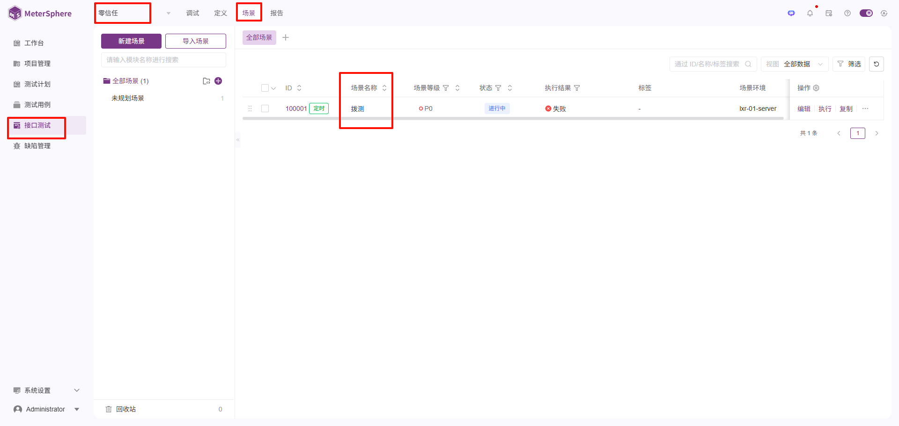
3. 设置定时任务(让场景定时跑，达到拨测的效果)
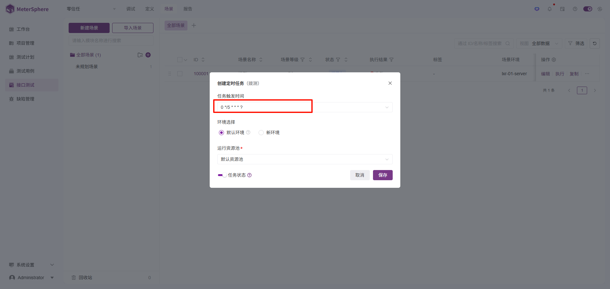

#### 复制接口信息

deepslo需要对接MeterSphere的接口，所以需要先复制下接口信息。
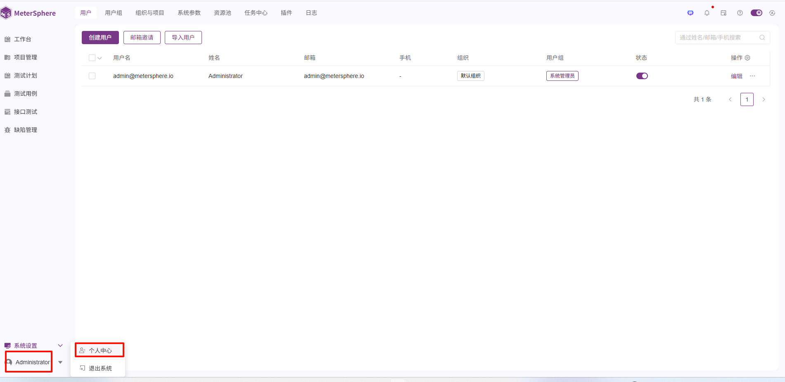
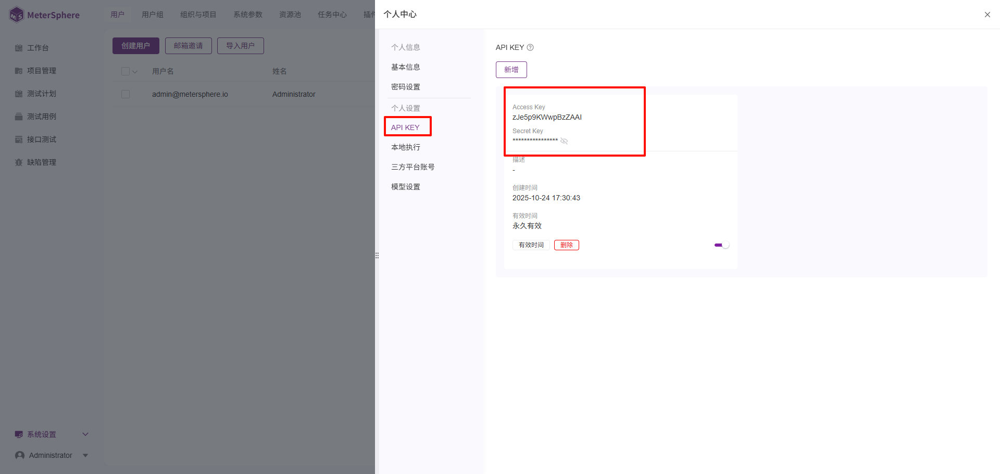
将sk、sk信息复制下来


### Deepslo 准备

1. 设置MeterSphere接口信息
   - 打开deepslo前端，默认名密码`admin/admin`,点击`系统配置`->`拨测配置`
   - 填写MeterSphere的`URL`、`AK`、`SK`
   - 点击`保存`
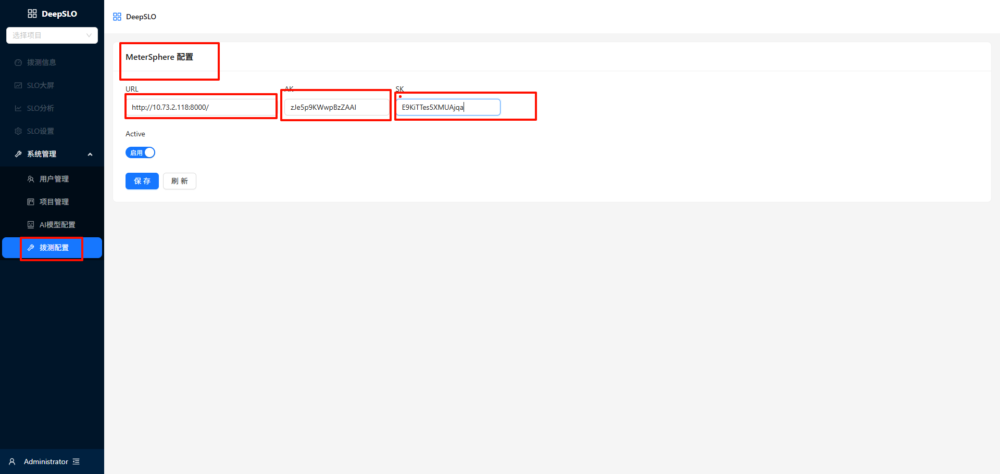

2. 设置模型
   - 点击`系统配置`->`AI模型配置`
   - 添加模型
   - 点击`保存`
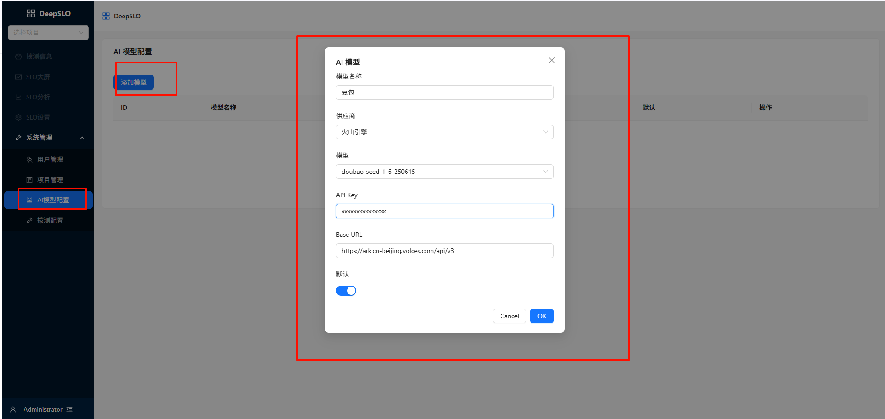

3. 同步项目管理
   - 点击`系统配置`->`项目管理`
   - 点击`同步 metersphere 项目`
   - 等待同步完成,会将MeterSphere的项目同步到deepslo的项目管理中
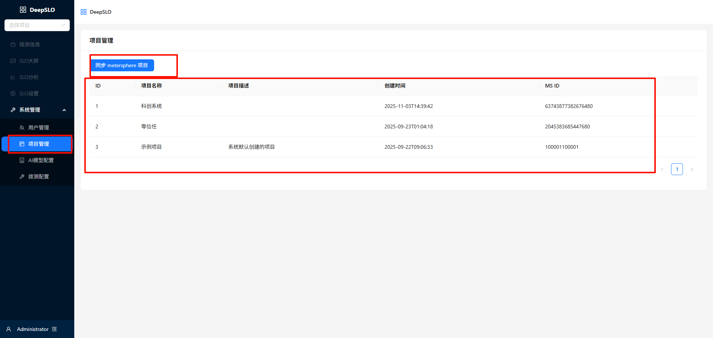

4. SLO 配置
   - 点击`SLO配置`
   - 新增SLO
   - 点击`保存`
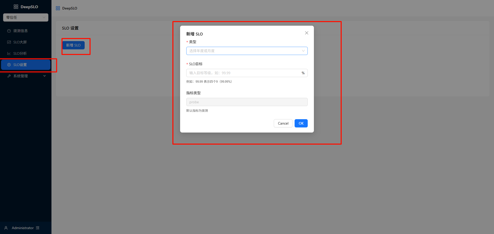
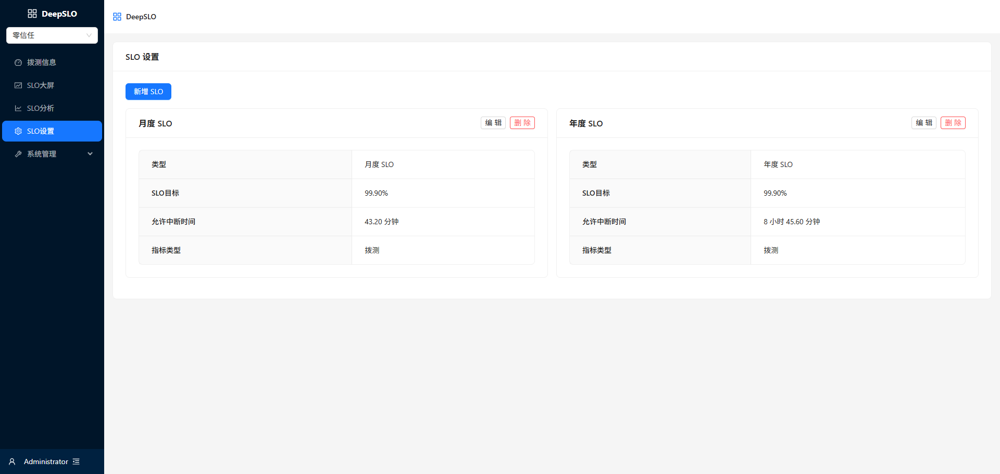
5. 拨测配置
   - 点击`拨测信息`->`同步拨测信息`，会将MeterSphere的拨测场景同步到deepslo的拨测管理中
   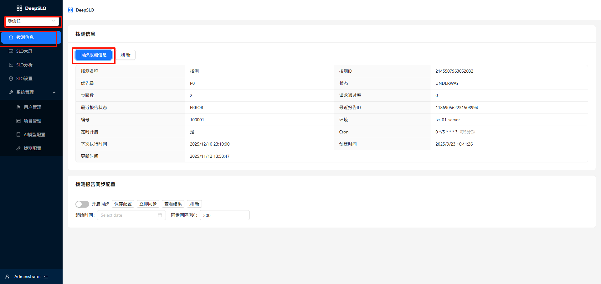
   - 下方有`拨测报告同步配置`, 可以选择同步拨测起始时间，不选择则会选取拨测创建的时间。 开启同步配置，点击`保存配置`
   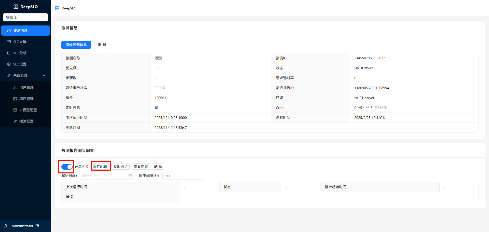
   - 可以点击`查看结果`
   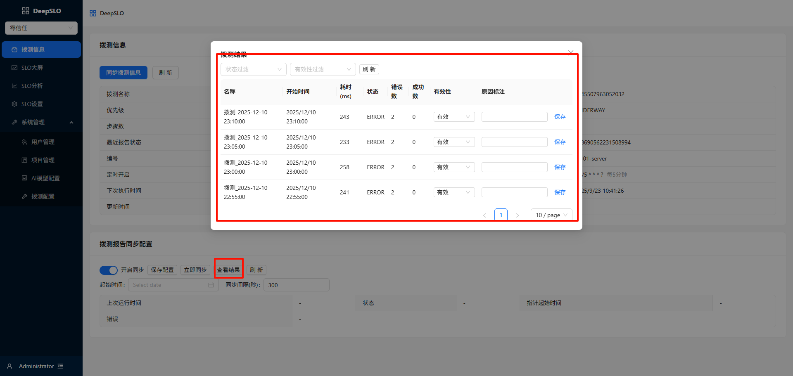
6. SLO大屏
   - 点击`SLO大屏`
   - 可以查看当前项目的SLO达成率、误差预算、拨测趋势、关联事件等
   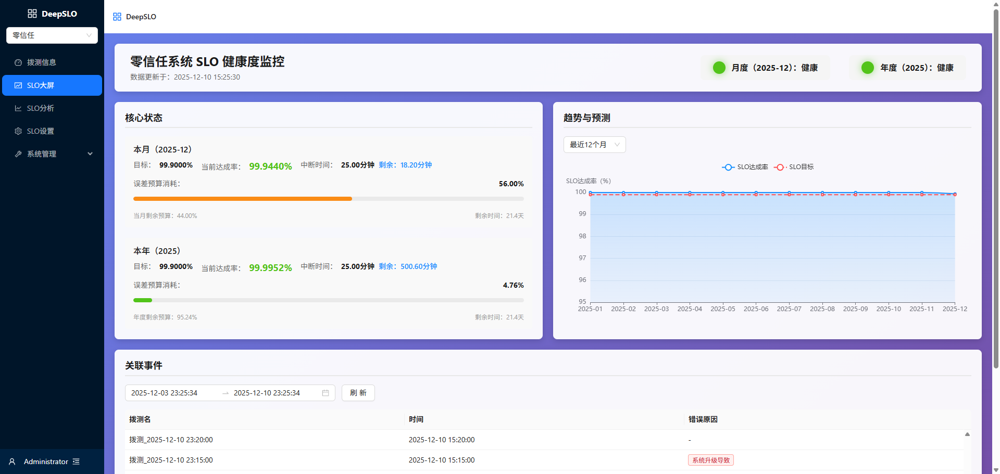

7. SLO分析
   - 点击`SLO分析`
   - 可以查看当前项目的SLO分析结果
   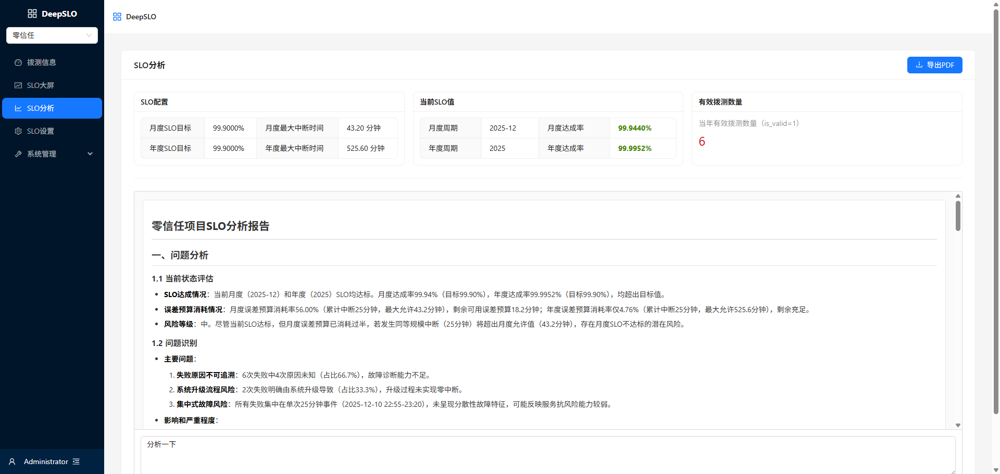
   - 可以导出报告 
   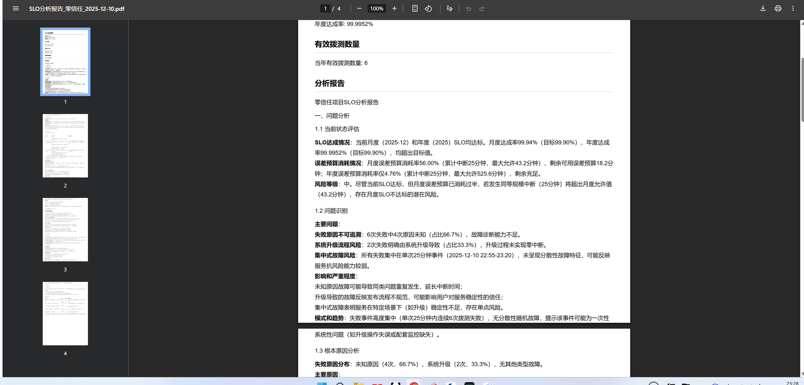


## 🆘 Support & Community

- Issues: [GitHub Issues](https://github.com/CallStorm/DeepSLO/issues)
- 邮箱：510908220@qq.com
- 社区与更多文档：建设中，欢迎在 Issue 中反馈诉求

---

## 📄 License

本项目基于 MIT License 发布，详情参见 [LICENSE](LICENSE)。

